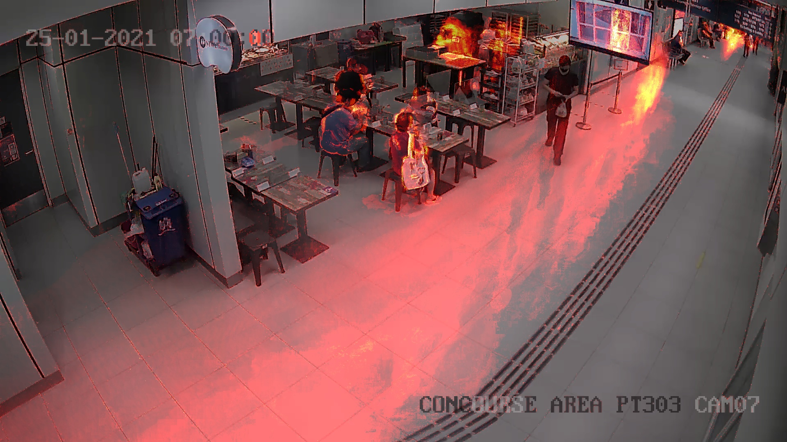

# HeatMapForPedestriansFootFall
The objective of this depository is to showcase pedestrian footfall. From this video clip, we find out the path that is taken by the pedestrian. This helps in finding out where the pedestrian usually walks. The brighter the spot, the longer the pedestrians where at a particular spot. It can be observed that at the side of the glass doors, very few pedestrians walk over that area. While more pedestrians tend to walk to the side nearer to the shops.

